# Configuración de un Servidor Nginx con Hosts Virtuales y Directorios de Usuario

# Conexion SSH
Para esta páctica trabajaremos desde nuestra propia máquina anfitriona y nos conectaremos 
a nuestra máquina virtual de Debian mediante SSH. Para ello, abrimos una terminal y ejecutamos:

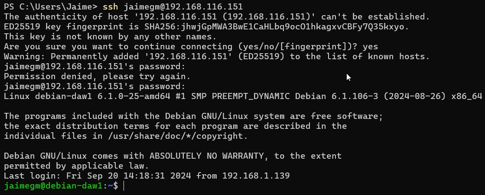

# Creacion de Usuarios
Para crear los usuarios en Debian, utilizamos el comando `useradd` seguido del nombre del usuario. Como se creará un directorio, se ejecutará el comando con la opción -m y -s para asignarle un directorio a cada usuario y un shell.

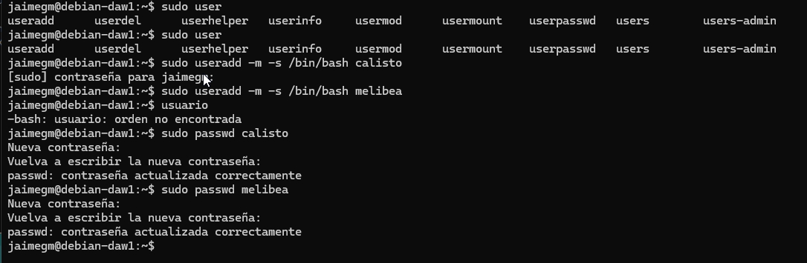

# Creación de las Carpetas public_html
Para la creación de las carpetas `public_html`, nos cambiaremos de usuario para poder crear dichas carpetas. Para ello, utilizamos el comando `su` seguido del nombre del usuario y `mkdir` para crear la carpeta.

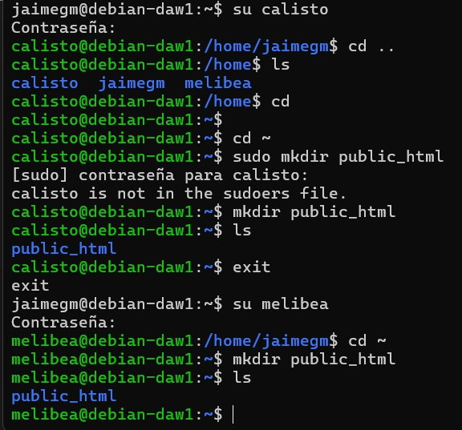

# Asignación de Permisos
Para asignar los permisos a las carpetas `public_html`, se cambiarán las ACLs de la carpeta `public_html` para que Nginx no tenga problemas para leer, escribir y ejecutar en la carpeta.

Este comando ``setfacl`` se utiliza para configurar las Listas de Control de Acceso (ACL) en el directorio ``public_html``. Específicamente:

``-d``: Establece las ACL predeterminadas (default) para el directorio4.

``-R``: Aplica los cambios de forma recursiva a todos los subdirectorios y archivos dentro de public_html3.

``-m``: Modifica las ACL existentes sin eliminar las anteriores5.

``u:www-data:rw``: Otorga permisos de lectura (r) y escritura (w) al usuario www-data

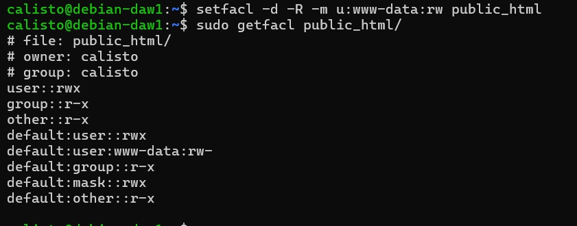

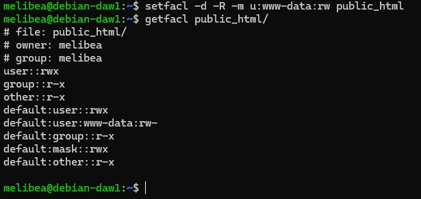

# Creación de Páginas Web Estáticas
Se crearán dos archivos index.html, uno para cada usuario en las carpetas `public_html` de cada usuario. Esto servirá para comprobar que todo está funcionando correctamente.

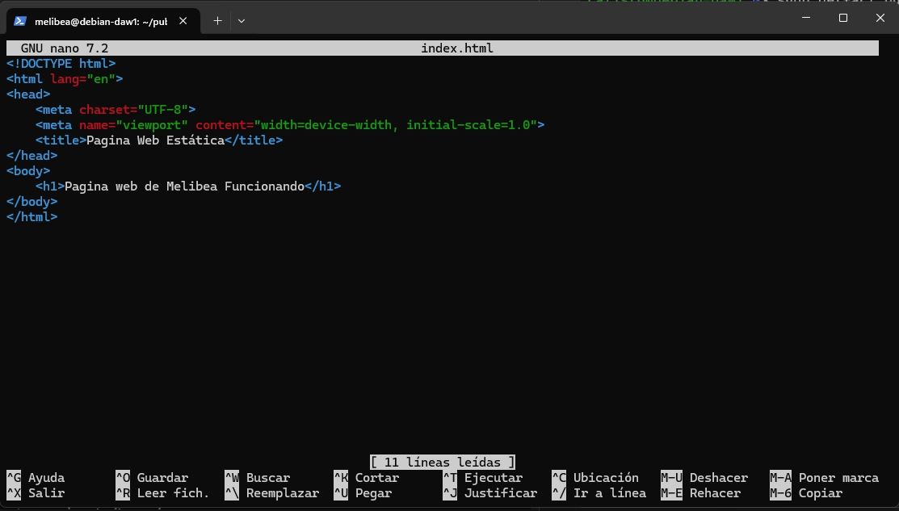

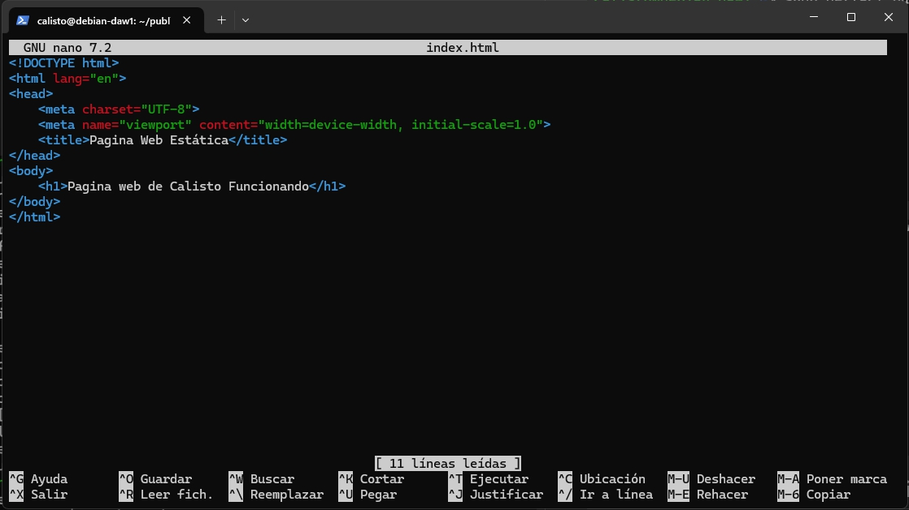

# Configuración de Nginx
Para instalar Nginx, utilizamos el comando `apt-get install nginx` y para comprobar que se ha instalado correctamente, utilizamos el comando `systemctl status nginx`. En mi caso ya tenía instalado Nginx, por lo que no fue necesario instalarlo. Se ejecutará el comando `systemctl status nginx` para comprobar que el servicio está activo.

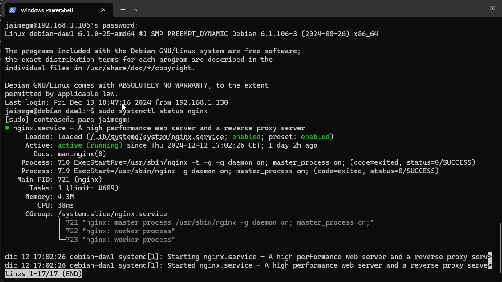

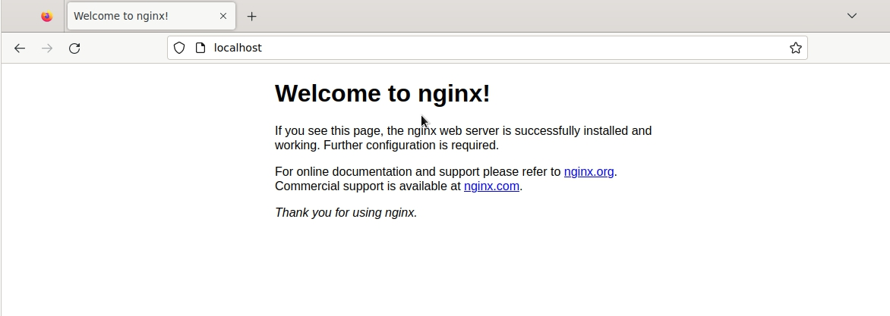

## Generación de Certificados SSL
Para generar los certificados SSL, utilizamos el comando `sudo openssl req -x509 -newkey rsa:4096 -keyout /etc/ssl/private/calistoweb.pem -out /etc/ssl/certs/calisto.pem -sha256 -days 365 --nodes`. Se nos pedirán una serie de datos que deberemos rellenar. Lo mismo se debreá hacer para el usuario `melibea`.	

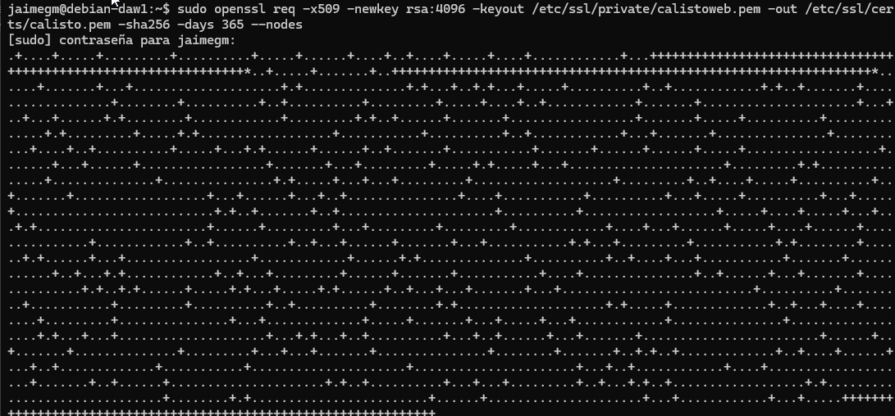
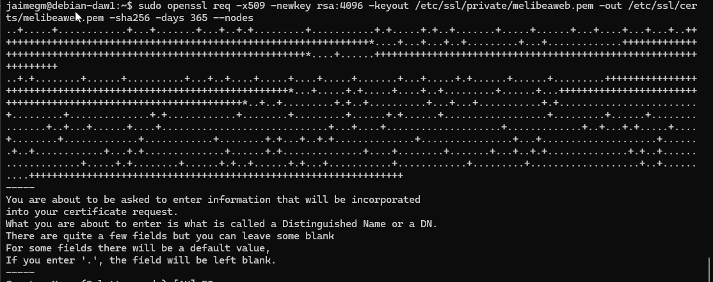

## Configuración de los Hosts Virtuales
Para configurar los hosts virtuales, se creará un archivo de configuración en la carpeta `/etc/nginx/sites-available` para cada usuario. En mi caso, he creado los archivos `calisto` y `melibea`. En estos archivos se configurarán los hosts virtuales para cada usuario.

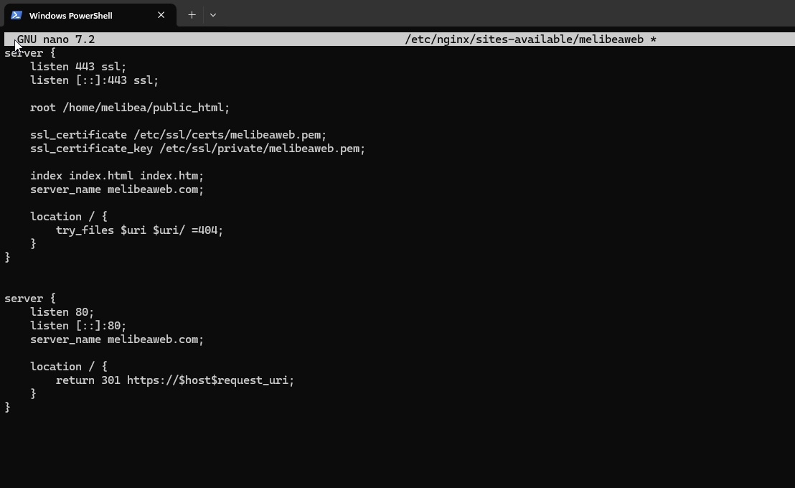

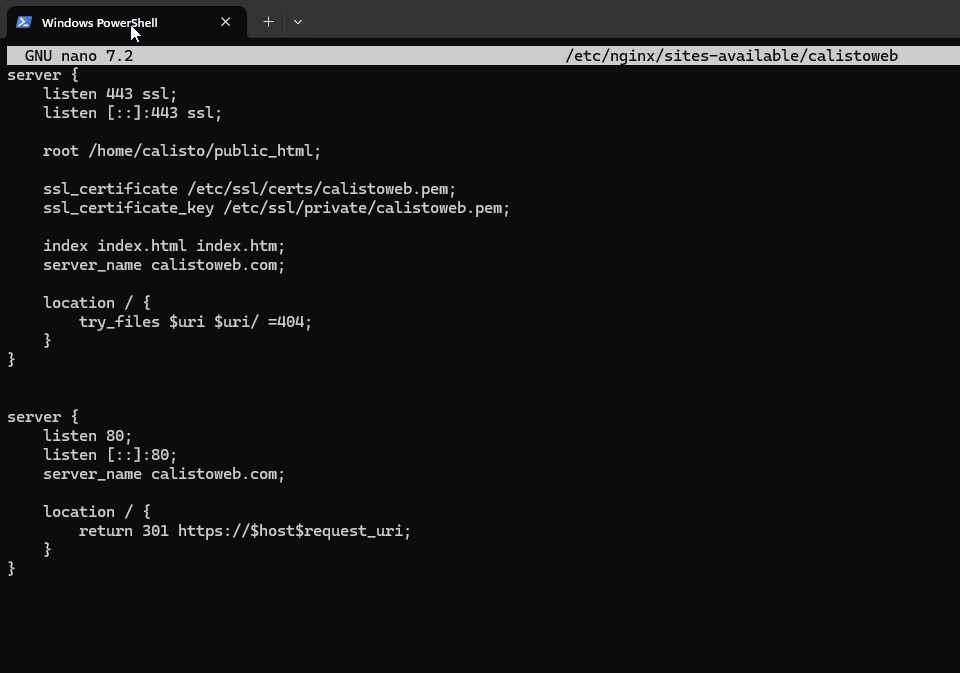

Hecho esto, se habilitarán los hosts virtuales con el comando `ln -s /etc/nginx/sites-available/calistoweb /etc/nginx/sites-enabled/` y `ln -s /etc/nginx/sites-available/melibeaweb /etc/nginx/sites-enabled/`. Al ejecitar estos comandos, se crearán enlaces simbólicos en la carpeta `/etc/nginx/sites-enabled/` que apuntarán a los archivos de configuración de los hosts virtuales, como se puede apreciar en la siguiente imagen.

Se ejecuta el comando `nginx -t` para comprobar que la configuración de los hosts virtuales es correcta y reiniciamos el servicio de Nginx con el comando `systemctl restart nginx`.

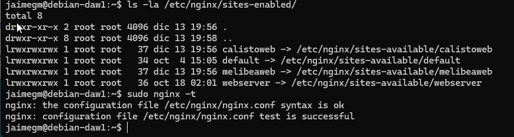

## Comprobación de los Hosts Virtuales
Se añadirán las direcciones IP y los nombres de los hosts virtuales en el archivo `C:\Windows\System32\drivers\etc\hosts` de nuestra máquina anfitriona.

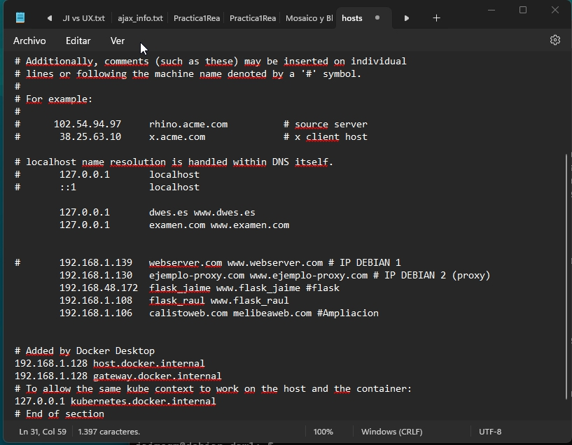

## Comprobación de Funcionamiento de los Hosts Virtuales
Se intentará acceder a las páginas web de los usuarios `calisto` y `melibea` desde un navegador web. Para ello, se abrirá un navegador web y se introducirán las direcciones `https://calisto` y `https://melibea`.

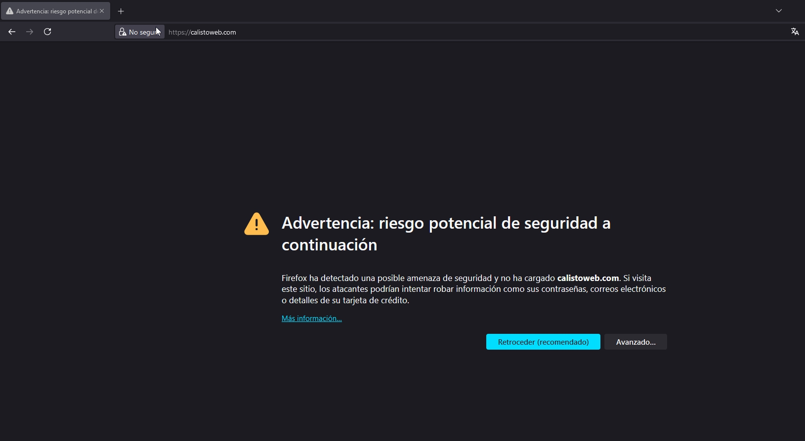

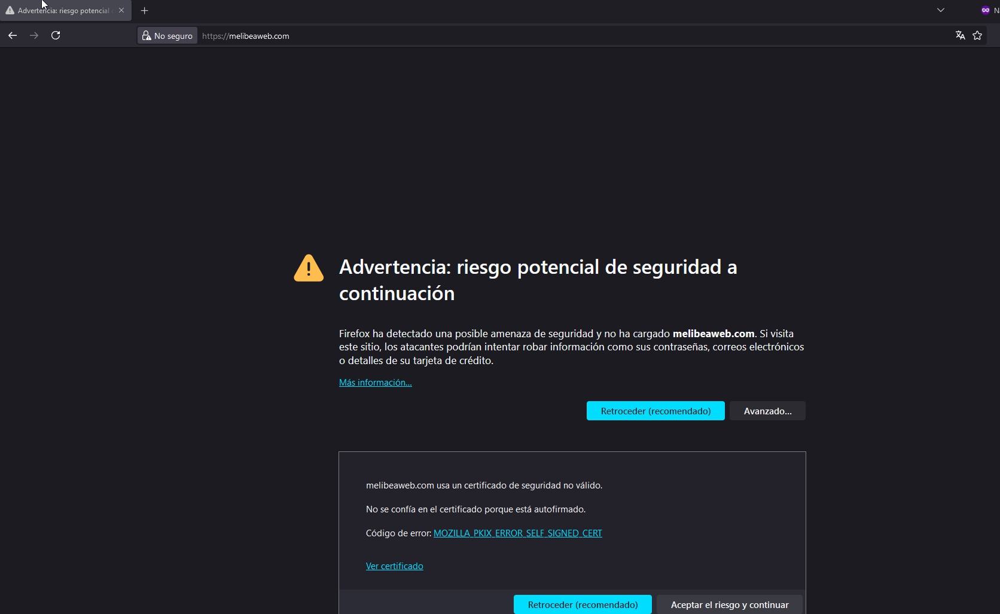

Al continuar y ver el certificado de seguridad, se podrá comprobar que el certificado SSL es válido.

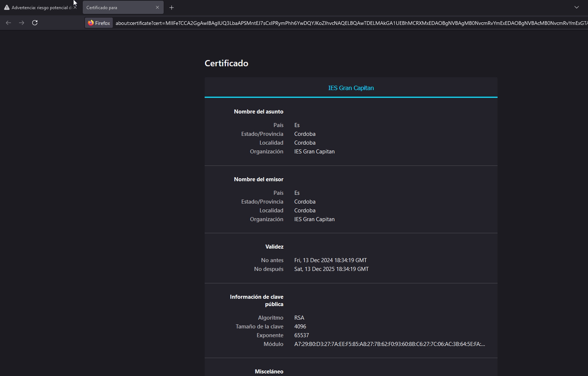

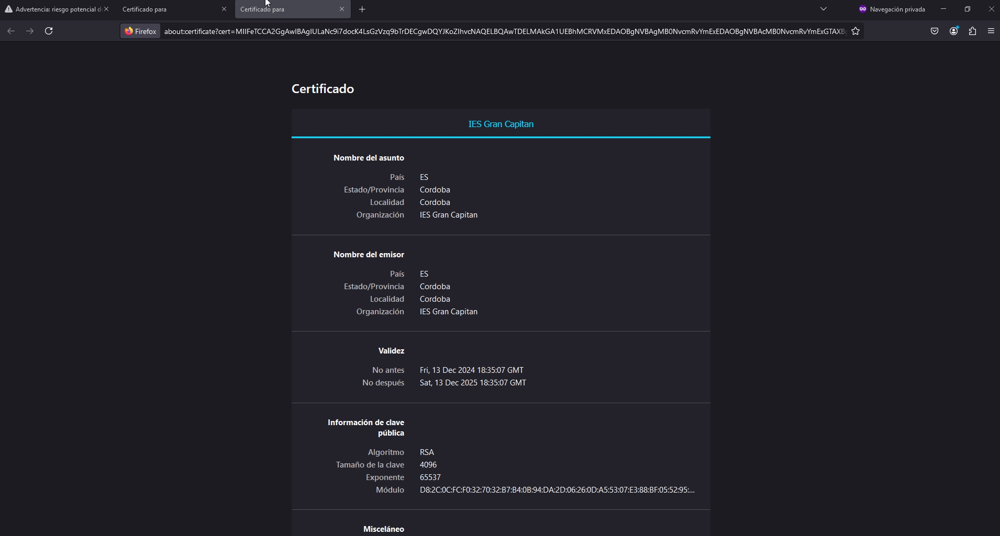

Para finalizar, se clickará en el botón `Aceptar el riesgo y continuar` para acceder a la página web. Y si todo ha ido bien, se podrá ver la página web del usuario `calisto` y `melibea`.

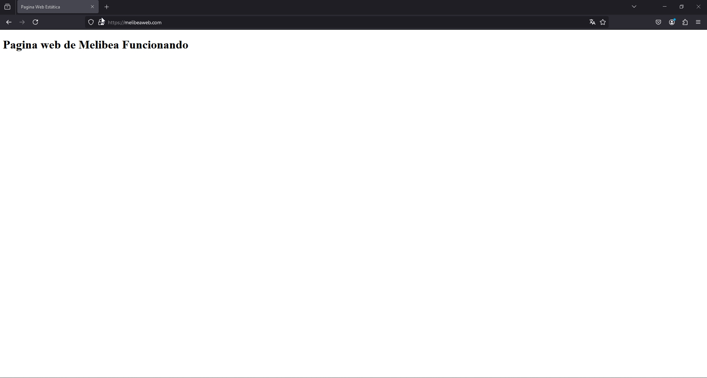

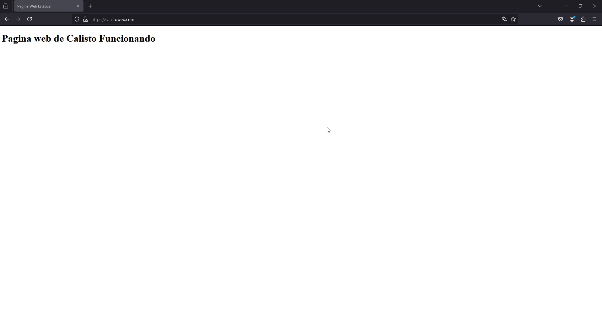

Con esto concluye la práctica de configuración de un servidor Nginx con hosts virtuales y directorios de usuario.

